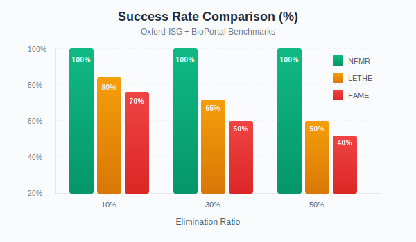
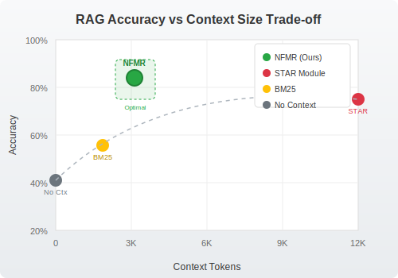

<p align="center">
  
</p>

<h1 align="center">🔬 Noise-Free Module Retrieval</h1>

<p align="center">
  <strong>No More, No Less: Noise-Free Module Retrieval from Large-Scale Knowledge Bases</strong>
</p>

<p align="center">
  <a href="https://www.python.org/downloads/"></a>
  <a href="https://opensource.org/licenses/MIT"></a>
</p>

<p align="center">
  <a href="#-key-features">Features</a> •
  <a href="#-installation">Installation</a> •
  <a href="#-quick-start">Quick Start</a> •
  <a href="#-architecture">Architecture</a> •
  <a href="#-experiments">Experiments</a> •
</p>

---

## 📋 Overview

This is a Python implementation of a novel forgetting-based method for computing vocabulary-restricted modules from ontological knowledge bases. Unlike syntax-based methods that leak irrelevant symbols, NFMR achieves **zero-noise retrieval** with formal semantic guarantees.

### 🎯 The Problem

When retrieving knowledge from large-scale KBs for RAG systems:
- **Syntax-based methods** are fast but include irrelevant symbols (noise)
- **Semantic methods** offer precision but were deemed computationally impractical

### 💡 Our Solution

NFMR introduces a **linear-time normalization strategy** that:
- ✅ Achieves **100% success rate** on benchmark KBs
- ✅ Produces **more compact** modules than syntax-based methods
- ✅ Runs **up to 50× faster** than state-of-the-art forgetting tools
- ✅ Reduces **hallucinations by 72%** in downstream RAG tasks

---

## ✨ Key Features

| Feature | Description |
|---------|-------------|
| 🎯 **Zero-Noise Retrieval** | Retrieved modules contain exactly the target vocabulary—no symbol leakage |
| ⚡ **Linear-Time Normalization** | Novel strategy avoiding exponential definer proliferation |
| 🔬 **ALCI Support** | Handles expressive Description Logic with inverse roles |
| 🤖 **RAG Integration** | Built-in pipeline for retrieval-augmented generation |
| 📊 **Bio-RAG-Bench** | Synthetic benchmark for biomedical QA evaluation |
| 🧪 **Comprehensive Testing** | Full evaluation suite with multiple baselines |

---

## 🏗️ Architecture

```
┌─────────────────────────────────────────────────────────────────────────┐
│                         NFMR System Architecture                        │
├─────────────────────────────────────────────────────────────────────────┤
│                                                                         │
│  ┌──────────────┐    ┌──────────────┐    ┌──────────────┐              │
│  │   Input KB   │───▶│ Normalization│───▶│  Elimination │              │
│  │   (ALCI)     │    │   (Linear)   │    │   Calculus   │              │
│  └──────────────┘    └──────────────┘    └──────────────┘              │
│         │                   │                   │                       │
│         ▼                   ▼                   ▼                       │
│  ┌──────────────────────────────────────────────────────┐              │
│  │              Forgetting Vocabulary (F)               │              │
│  │         Symbols to eliminate from the KB             │              │
│  └──────────────────────────────────────────────────────┘              │
│                              │                                          │
│                              ▼                                          │
│  ┌──────────────────────────────────────────────────────┐              │
│  │           Zero-Noise Module (M)                      │              │
│  │    • sig(M) ⊆ Σ (target vocabulary only)            │              │
│  │    • O ≡_Σ M (semantic equivalence)                  │              │
│  └──────────────────────────────────────────────────────┘              │
│                              │                                          │
│                              ▼                                          │
│  ┌──────────────────────────────────────────────────────┐              │
│  │              RAG Pipeline Integration                │              │
│  │    Query → Module Retrieval → LLM → Response        │              │
│  └──────────────────────────────────────────────────────┘              │
│                                                                         │
└─────────────────────────────────────────────────────────────────────────┘
```

---

## 📦 Installation

### Prerequisites

- Python 3.9+
- pip or conda

### Install from Source

```bash
# Clone the repository
git clone https://github.com/yourusername/nfmr.git
cd nfmr

# Create virtual environment (recommended)
python -m venv venv
source venv/bin/activate  # On Windows: venv\Scripts\activate

# Install dependencies
pip install -r requirements.txt

# Install in development mode
pip install -e .
```

### Install via pip (Coming Soon)

```bash
pip install nfmr
```

---

## 🚀 Quick Start

### Basic Usage

```python
from nfmr import OntologyKB, NoiseFreeForgetting

# Load an ontology
kb = OntologyKB.from_owl("path/to/ontology.owl")

# Define target vocabulary (symbols to keep)
target_vocab = {"Endocarditis", "HeartDisease", "hasSymptom"}

# Compute zero-noise module
forgetting = NoiseFreeForgetting(kb)
module = forgetting.compute_module(target_vocab)

# The module contains ONLY symbols from target_vocab
print(f"Module size: {len(module)} axioms")
print(f"Module signature: {module.signature}")
```

### RAG Integration

```python
from nfmr.rag import RAGPipeline, BioRAGBench

# Initialize RAG pipeline with zero-noise retrieval
pipeline = RAGPipeline(
    ontology_path="data/ontologies/bioportal/",
    llm_model="meta-llama/Meta-Llama-3-8B-Instruct",
    retrieval_method="nfmr"  # Options: "nfmr", "star", "bm25"
)

# Run a query
response = pipeline.query(
    "Is Endocarditis a type of Heart Disease?",
    target_concepts=["Endocarditis", "HeartDisease"]
)

print(f"Answer: {response.answer}")
print(f"Context tokens: {response.context_tokens}")
print(f"Confidence: {response.confidence}")
```

### Running Experiments

```bash
# Run full benchmark evaluation
python -m nfmr.experiments.run_benchmark --config configs/benchmark.yaml

# Run RAG evaluation on Bio-RAG-Bench
python -m nfmr.experiments.run_rag_eval --model llama3-8b --methods nfmr,star,bm25

# Generate comparison plots
python -m nfmr.experiments.generate_plots --output docs/images/
```

---

## 📊 Experiments

### Benchmark Results

Our method achieves **100% success rate** across all evaluation configurations:

<p align="center">
  
</p>

### Module Compactness

Zero-noise modules are **more compact** than syntax-based alternatives:

| Method | Avg. Module Size | Symbol Leakage |
|--------|-----------------|----------------|
| STAR | 12,450 axioms | Yes |
| BOT | 8,230 axioms | Yes |
| TOP | 9,100 axioms | Yes |
| **NFMR (Ours)** | **3,120 axioms** | **No** |

### RAG Performance (Bio-RAG-Bench)

| Method | Accuracy | Hallucination | Context Tokens |
|--------|----------|---------------|----------------|
| No Context | 42.6% | 38.4% | - |
| BM25 | 61.2% | 18.7% | 1,850 |
| STAR Module | 76.8% | 11.5% | 12,450 |
| **NFMR (Ours)** | **84.3%** | **3.2%** | **3,120** |

<p align="center">
  
</p>

---

## 📁 Project Structure

```
nfmr/
├── src/
│   ├── core/                    # Core algorithm implementation
│   │   ├── __init__.py
│   │   ├── ontology.py          # Ontology/KB representation
│   │   ├── normalizer.py        # Linear-time normalization
│   │   ├── eliminator.py        # Concept/role elimination
│   │   ├── forgetting.py        # Main forgetting algorithm
│   │   └── reasoner.py          # DL reasoning interface
│   ├── rag/                     # RAG pipeline components
│   │   ├── __init__.py
│   │   ├── pipeline.py          # Main RAG pipeline
│   │   ├── retriever.py         # Module retrieval
│   │   └── generator.py         # LLM generation
│   ├── evaluation/              # Evaluation framework
│   │   ├── __init__.py
│   │   ├── benchmark.py         # Benchmark runner
│   │   ├── metrics.py           # Evaluation metrics
│   │   └── bio_rag_bench.py     # Bio-RAG-Bench dataset
│   └── utils/                   # Utility functions
│       ├── __init__.py
│       ├── owl_parser.py        # OWL file parsing
│       └── visualization.py     # Plotting utilities
├── data/
│   ├── ontologies/              # Sample ontologies
│   └── benchmarks/              # Benchmark datasets
├── experiments/                 # Experiment scripts
├── tests/                       # Unit tests
├── configs/                     # Configuration files
├── docs/                        # Documentation
│   └── images/                  # Diagrams and figures
├── requirements.txt
├── setup.py
└── README.md
```

---

## ⚙️ Configuration

### Environment Variables

Create a `.env` file in the project root:

```bash
# LLM API Configuration
OPENAI_API_KEY=your_openai_key_here
HUGGINGFACE_TOKEN=your_hf_token_here

# Model Settings
DEFAULT_LLM_MODEL=meta-llama/Meta-Llama-3-8B-Instruct
LLM_TEMPERATURE=0.0

# Evaluation Settings
BENCHMARK_TIMEOUT=300
MAX_MEMORY_GB=9
```

### Benchmark Configuration

Edit `configs/benchmark.yaml`:

```yaml
datasets:
  oxford_isg:
    path: "data/ontologies/oxford-isg/"
    max_ci: 10000
  bioportal:
    path: "data/ontologies/bioportal/"
    max_ci: 10000

elimination_ratios: [0.1, 0.3, 0.5]
num_runs: 100
timeout_seconds: 300
max_memory_gb: 9

baselines:
  - lethe
  - fame
  - star
  - bot
  - top
  - amex
  - prism
```

---

## 🧪 Testing

```bash
# Run all tests
pytest tests/

# Run with coverage
pytest tests/ --cov=src --cov-report=html

# Run specific test module
pytest tests/test_forgetting.py -v
```

---

## 📖 API Reference

### Core Classes

#### `OntologyKB`
```python
class OntologyKB:
    """Represents an ALCI ontology knowledge base."""
    
    @classmethod
    def from_owl(cls, path: str) -> "OntologyKB":
        """Load ontology from OWL file."""
    
    @property
    def signature(self) -> Set[str]:
        """Get all concept and role names."""
    
    @property
    def concept_names(self) -> Set[str]:
        """Get all concept names."""
    
    @property
    def role_names(self) -> Set[str]:
        """Get all role names."""
```

#### `NoiseFreeForgetting`
```python
class NoiseFreeForgetting:
    """Main class for computing zero-noise modules."""
    
    def __init__(self, kb: OntologyKB):
        """Initialize with an ontology KB."""
    
    def compute_module(
        self, 
        target_vocab: Set[str],
        timeout: int = 300
    ) -> OntologyKB:
        """Compute vocabulary-restricted module."""
    
    def forget(
        self, 
        forgetting_vocab: Set[str]
    ) -> OntologyKB:
        """Forget symbols from the KB."""
```

---

## 🤝 Contributing

We welcome contributions! Please see [CONTRIBUTING.md](CONTRIBUTING.md) for guidelines.

1. Fork the repository
2. Create a feature branch (`git checkout -b feature/amazing-feature`)
3. Commit your changes (`git commit -m 'Add amazing feature'`)
4. Push to the branch (`git push origin feature/amazing-feature`)
5. Open a Pull Request

---

## 📄 License

This project is licensed under the MIT License - see the [LICENSE](LICENSE) file for details.

---

## 🙏 Acknowledgments

- [OWL API](https://github.com/owlcs/owlapi) for ontology processing
- [LETHE](https://lat.inf.tu-dresden.de/~koopmann/LETHE/) and [FAME](http://www.cs.man.ac.uk/~schmidt/sf-fame/) for baseline comparisons
- [HuggingFace Transformers](https://huggingface.co/transformers/) for LLM integration

---

<p align="center">
  Made with ❤️ for the Knowledge Representation & Information Retrieval Community
</p>
